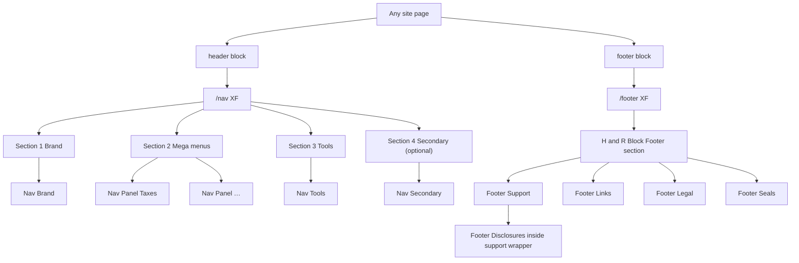

# Nav & Footer — Universal Editor Authoring Guide

Authors control **all** nav and footer copy, links, icons, and cards in Universal Editor.  
Block JavaScript only decorates markup — **nothing is hardcoded**.

| Surface | Authored page / XF | Loaded by | Default path |
|---------|-------------------|-----------|--------------|
| Header / mega menu | Nav Experience Fragment | `header` block | `/nav` |
| Footer | Footer Experience Fragment | `footer` block | `/footer` |

Optional page metadata overrides:

- `nav` → path to an alternate nav XF  
- `footer` → path to an alternate footer XF  

---

## 1. Architecture (template → content)



---

## 2. Nav content tree (Universal Editor)

Create or open the **Nav** page / Experience Fragment that publishes to `/nav`.

Build **3 sections** (plus optional section 4 for Tax Center), in this order (section order = layout regions):

```
/nav
├── Section 1 — Brand          ← becomes .nav-brand
│   └── Nav Brand
├── Section 2 — Mega menus     ← becomes .nav-sections
│   ├── Nav Panel (Taxes)
│   │   ├── Mega Explore
│   │   ├── Mega Primary Links
│   │   ├── Mega Column × n
│   │   └── Mega Card × n
│   ├── Nav Panel (Financial products)
│   │   └── … same children as needed …
│   ├── Nav Panel (Business services)
│   └── Nav Panel (Tools and resources)
├── Section 3 — Tools          ← becomes .nav-tools
│   └── Nav Tools
│       ├── Nav Tool (Find an office)
│       ├── Nav Tool (Search)
│       └── Nav Sign In
└── Section 4 — Secondary      ← optional Tax Center topic bar
    └── Nav Secondary
        ├── Nav Secondary Explore (Explore All Topics)
        └── Nav Secondary Link × n (Life Stages, Work, …)
```

### 2.1 Nav Brand

| Field | Author freedom | Example |
|-------|----------------|---------|
| Logo Image | DAM reference | H&R Block logo |
| Logo Alt Text | free text | `H&R Block` |
| Logo Link | any page / URL | `/` |
| Accessible Name | free text | `H&R Block` |
| Link Title | free text | optional |

### 2.2 Nav Panel (one per top-nav label)

| Field | Author freedom | Example |
|-------|----------------|---------|
| Top Nav Link | any page / URL | `/taxes/` |
| Top Nav Label | free text | `Taxes` |
| Link Title | free text | optional |

**Children** (add as many as you need — order = left → right / top → bottom in the mega menu):

| Child | Purpose | Key fields |
|-------|---------|------------|
| **Mega Explore** | Large “Explore …” heading link | Link + label (e.g. `Explore taxes`) |
| **Mega Primary Links** | Bold primary link list | Richtext list of links |
| **Mega Column** | Headed column of links | Heading + richtext link list |
| **Mega Card** | Promo tile | Optional DAM image, title, description, **Card Style** (`green` / `cream` / `accent`), optional disclaimer paragraph |

Authors may:

- Add / remove / reorder panels  
- Leave explore, primary, columns, or cards empty  
- Use text-only cards (no image) or image + text cards  

### 2.3 Nav Tools

Inside **Nav Tools**, add items freely:

| Child | Purpose | Key fields |
|-------|---------|------------|
| **Nav Tool** | Utility link (office, search, …) | DAM icon, link, label |
| **Nav Sign In** | Pill CTA | DAM icon, eyebrow (`Sign in to`), primary label (`MyBlock`), link |

Add as many Nav Tools as needed; place Sign In last for typical desktop layout.

### 2.4 Nav Secondary (optional — Tax Center)

Add as **Section 4** of `/nav` (or a page-specific nav XF). Omit this section on pages that should not show the topic bar.

| Child | Purpose | Key fields |
|-------|---------|------------|
| **Nav Secondary Explore** | “Explore All Topics” with grid icon | DAM icon, label, optional topics list |
| **Nav Secondary Link** | Category link in the topic bar | Link + label (Life Stages, Work, Taxes 101, …) |

---

## 3. Footer content tree (Universal Editor)

Create or open the **Footer** page / XF that publishes to `/footer`.

**Preferred:** add one **H&R Block Footer** section (auto styles: `site-footer` + `green-dark-theme`).

**Alternate:** use a normal Section and set Style → **Site Footer** + **Green Dark Theme**.

Authors still insert **Footer Disclosures** as a sibling of **Footer Support** (EDS cannot nest blocks in UE). After decorate, the footer moves Disclosures **inside** `.footer-support-wrapper` so it sits above “Need support?” in the same support region.

```
/footer
└── H&R Block Footer   (or Section + site-footer + green-dark-theme)
    ├── Footer Disclosures     ← authored as sibling; rendered inside Footer Support wrapper
    │   ├── heading: Offer details and disclosures
    │   ├── Disclosure Group — Full Site Disclaimers + links
    │   └── Disclosure Notes — numbered offer footnotes
    ├── Footer Support
    │   ├── heading: Need support?
    │   ├── Support Action — Customer help
    │   ├── Support Action — Find an office
    │   └── Support Action — Search
    ├── Footer Links
    │   ├── Footer Column — Tax Services + Small Business…
    │   ├── Footer Column — Tax Tools + Legal…
    │   ├── Footer Column — Financial Services + Resources…
    │   └── Footer Column — About H&R Block…
    ├── Footer Legal
    │   ├── Legal / Copyright richtext
    │   ├── Social Link — TikTok
    │   ├── Social Link — Facebook
    │   ├── Social Link — Instagram
    │   ├── Social Link — YouTube
    │   └── Social Link — X / LinkedIn
    └── Footer Seals
        ├── Footer Seal — TRUSTe (DAM image + link)
        └── Footer Seal — Your Privacy Choices (link label only)
```

### 3.1 Footer Disclosures

Collapsible accordion for offer details. Place it **first** in the H&R Block Footer section (before Footer Support). The page then loads it **inside** `.footer-support-wrapper`, above the Need support? row.

| Field / child | Author freedom |
|---------------|----------------|
| Heading | free text (e.g. `Offer details and disclosures`) |
| Heading Type | H2 / H3 / H4 |
| **Disclosure Group** × n | Group heading + richtext link list (e.g. Full Site Disclaimers) |
| **Disclosure Notes** | richtext footnotes (e.g. `3. Additional fees apply…`) |

### 3.2 Footer Support

| Field / child | Author freedom |
|---------------|----------------|
| Heading | free text (e.g. `Need support?`) |
| Heading Type | H2 / H3 / H4 |
| **Support Action** × n | DAM icon, link, label — add/remove/reorder freely |

### 3.3 Footer Links

Add **Footer Column** items (typically 4). Each column is richtext:

```html
<h5><strong>Tax Services</strong></h5>
<ul>
  <li><a href="/…">Reschedule or manage appointment</a></li>
  …
</ul>
<h5><strong>Small Business Services</strong></h5>
<ul>…</ul>
```

Authors control headings, link text, URLs, and how many menus sit in each column.

### 3.4 Footer Legal

| Field / child | Author freedom |
|---------------|----------------|
| Legal / Copyright Text | richtext — any paragraphs |
| **Social Link** × n | DAM icon + URL + accessible name |

### 3.5 Footer Seals

| Child | Author freedom |
|-------|----------------|
| **Footer Seal** | DAM image (optional), alt, link, label — image seal **or** text-only link |

---

## 4. Universal Editor step-by-step

### Nav

1. Open `/nav` (or the XF mapped to `/nav`) in Universal Editor.  
2. Add **Section 1** → insert **Nav Brand** → pick logo from DAM, set home link.  
3. Add **Section 2** → for each top nav item insert **Nav Panel** → fill label/link → add Explore / Primary / Columns / Cards as needed.  
4. Add **Section 3** → insert **Nav Tools** → add Nav Tool items + Nav Sign In.  
5. Optionally add **Section 4** → insert **Nav Secondary** (Tax Center topic bar).  
6. Preview on desktop (mega open) and mobile (hamburger).  
7. Publish. Site pages load it via the `header` block.

### Footer

1. Open `/footer` (or footer XF) in Universal Editor.  
2. Add **H&R Block Footer** (or Section with Site Footer + Green Dark Theme).  
3. Insert **Footer Disclosures** first → heading + Disclosure Group + Notes (optional). It will render inside the Footer Support wrapper.
4. Insert **Footer Support** → heading + Support Actions.
5. Insert **Footer Links** → Footer Columns with richtext menus.
6. Insert **Footer Legal** → copyright + Social Links.
7. Insert **Footer Seals** → seals / privacy links.
8. Publish. Site pages load it via the `footer` block.

---

## 5. Author freedom checklist

| Area | Fully authorable |
|------|------------------|
| Logo & brand link | Yes — DAM + URL |
| Top nav labels & URLs | Yes — any number of Nav Panels |
| Mega explore / primary / columns / cards | Yes — add, remove, reorder |
| Card images & styles | Yes — DAM + green/cream/accent |
| Find office / Search / other utilities | Yes — any number of Nav Tools |
| Sign-in eyebrow, label, icon, URL | Yes |
| Tax Center topic bar | Yes — Nav Secondary (optional section 4) |
| Footer disclosures accordion | Yes — groups + notes |
| Footer heading & support actions | Yes |
| Footer link columns & menus | Yes — richtext |
| Copyright / legal copy | Yes — richtext |
| Social icons | Yes — DAM + URLs |
| Seals & privacy links | Yes — DAM and/or text |

Styling (colors, spacing, mega layout, footer theme) is provided by CSS. Authors do not need to edit code to change content.

---

## 6. Production content reference (optional starting point)

Use live [hrblock.com](https://www.hrblock.com/) as a content checklist when first authoring — copy labels and URLs into UE fields. Do **not** put that content in JavaScript.

**Nav panels often include:** Taxes · Financial products · Business services · Tools and resources  

**Footer support often includes:** Need support? · Customer help · Find an office · Search  

**Footer columns often include:** Tax Services, Small Business Services, Tax Tools, Legal, Financial Services, Resources, About H&R Block  

---

## 7. Developer notes (for implementers)

- `blocks/header/header.js` → `loadFragment(nav metadata || '/nav')`  
- `blocks/footer/footer.js` → `loadFragment(footer metadata || '/footer')`  
- Footer Disclosures is authored as a sibling block. `footer-support.js` and `footer.js` prepend it into `.footer-support-wrapper` so it loads with the support region (preview: `/drafts/footer`).  
- Models live in `blocks/nav-*` and `blocks/footer-*` `_*.json` files; run `npm run build:json` after model changes  
- Section styles `site-footer` / `green-dark-theme` are defined in `models/_section.json` and styled in `styles/lazy-styles.css`  
